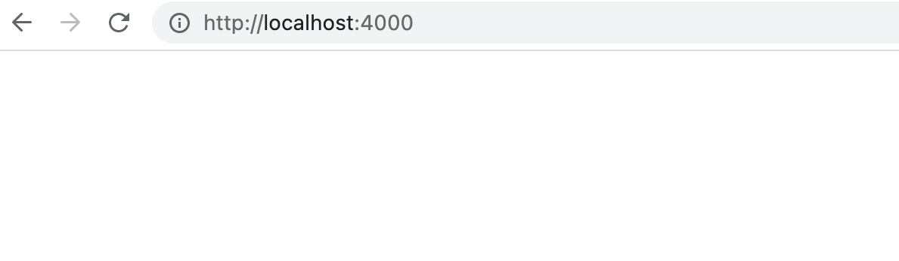
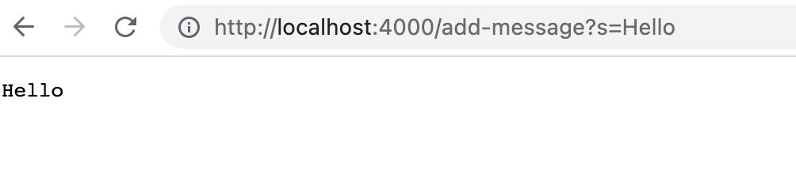
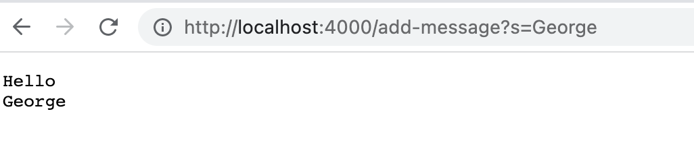
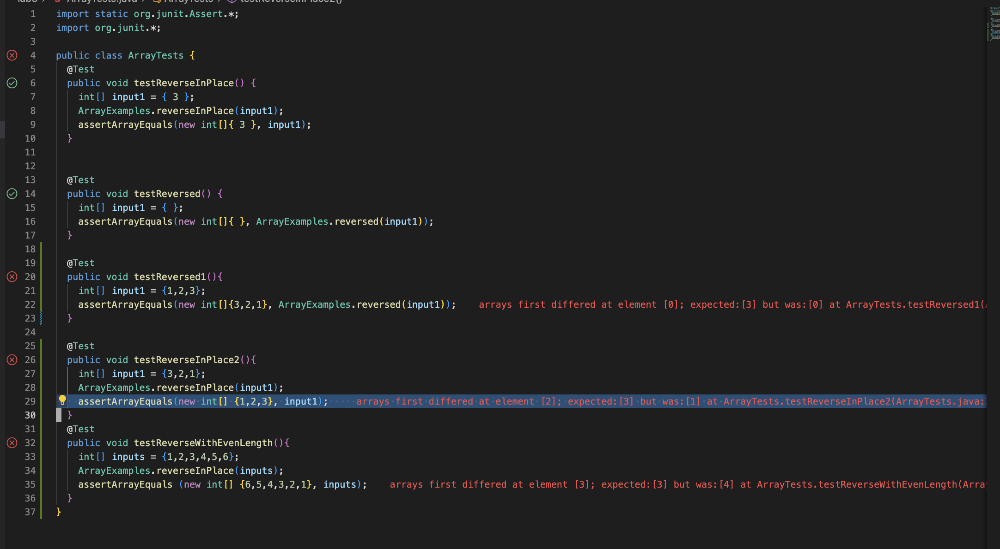

# Lab Report 2 
---
## Part 1: Implement `String Server` web server

In lab 2, we implemented a web server called `StringServer` that supports the path and behavior described below:

```
/add-message?s=\<string\>
```

so for example, after 

```
/add-message?s=Hello
``` 
The page should show
```
Hello
```
and after 
```
/add-message?s=George
``` 
The page should show
```
Hello 
George
```

### Code 

```Java
import java.io.IOException;
import java.net.URI;

 
class Handler implements URLHandler {
    // The one bit of state on the server: a number that will be manipulated by
    // various requests.
    String s = ""; 

    public String handleRequest(URI url) {
        if (url.getPath().equals("/")) {
            return s;
        } else {
            System.out.println("Path: " + url.getPath());
            if (url.getPath().contains("/add-message")) {
                String[] parameters = url.getQuery().split("=");
                if (parameters[0].equals("s")) {
                    s += parameters[1] + "\n";
                    return s; 
                }
            }
            return "404 Not Found!";
        }
    }
}
class StringServer{
    public static void main(String[] args) throws IOException {
        if(args.length == 0){
            System.out.println("Missing port number! Try any number between 1024 to 49151");
            return;
        }

        int port = Integer.parseInt(args[0]);

        Server.start(port, new Handler());
    }
}

```

### Demo
Upon first visiting my web server, we will see an empty page as shown below: 



The method that triggers the webserver to start is the main method when `Server.start(port, new Handler());` is ran. In my case, I ran the server with the port 4000 in my local machine. 

Then, after running
```
/add-message?s=Hello
```
and visiting our homepage, our page appeared as follow: 


This is because the request triggered our `handleRequest` with the argument `Path + "add-message?s=Hello"`. `handleRequest` then checks if the path contains "/add-message". If the path contains `"/add-message"`, we will split the url by the `"="` character and get everything after `"="` appended to our homepage along with a newline. As a result, "Hello" was appended to our webpage.

Then after running 
```
/add-message?s=George
```
, our homepage appeared as follow: 


This is because the request triggered our method 
`handleREquest` with the argument `Path + "/add-message?s=George"`. `handleRequest` then checks if the path contains "/add-message", which this path does. Then, it splits the url by `"="` and concatenating everything after the `"="` to our website's homepage. As a result, "George" was appended to our website's homepage as appears in our image.  

# Part 2: Debugging Exercise. 

In lab today, I debugged the `reverseInPlace` method in `ArrayExamples.java`. 

A failure-inducing input for the buggy program was the array `{1,2,3}`. To test this input using junit, I wrote the following junit code: 

```Java
  @Test
  public void testReverseInPlace2(){ 
    int[] input1 = {3,2,1}; 
    ArrayExamples.reverseInPlace(input1);
    assertArrayEquals(new int[] {1,2,3}, input1); 
  }
``` 

An input that doesn't fail for this buggy program was an array with one element, such as `{ 3 }`. The junit test that I ran to test this input was:
 
 ```Java 
	@Test 
	public void testReverseInPlace() {
        int[] input1 = { 3 };
        ArrayExamples.reverseInPlace(input1);
        assertArrayEquals(new int[]{ 3 }, input1);
    }
 ``` 
 
The symptoms of the bug can be shown as I ran my tests. Below is a screenshot showing my tests failing: 




I soon figured that the `reverseInPlace` method has two bugs. The first bug is that the forloop is iterating through the entire array. We only need to interate through half of the array and swap each element with it's complement index. The second bug is that we are not properly swapping the elements. This is because `arr[i] = arr[arr.length - i - 1]` doesn't swap the elements in both ends. Only `arr[i]` contains the swap value. To properly swap the two element, we must first create a temporary storage, to store `arr[i]` and rewrite `arr[i]` with the swap value. Then we swap the value to `arr[arr.length -i -1]` by setting it with what is stored in the temporary variable.


This is the code before with bugs: 
```Java
static void reverseInPlace(int[] arr) {
    for(int i = 0; i < arr.length; i += 1) {
      arr[i] = arr[arr.length - i - 1];
    }
  }
``` 

This is the code after we fix the bugs: 
```Java 
static void reverseInPlace(int[] arr) {
    int temp;
    for(int i = 0; i < arr.length/2; i += 1) {
      temp = arr[i];
      arr[i] = arr[arr.length - i - 1];
      arr[arr.length - i - 1] = temp; 
    }
  }
```

The fix address the issue because we made sure to only iterate through half of the array. And for each element before we reach the halfway mark of the array, we properly swap the element with converse of its current index on the array. 


# Part 3: Brief Reflection 

In lab2 and lab3, I learned how to create a web server in Java from start to finish, something I have never done before. In lab3, I also learned how to use Junit for the first time. I have never taken any CSE courses before since I am majoring in Data Science, and thus have never debugged code using unit tests. Lastly, I learned to use Github Desktop. I usually use git from the terminal, and using Github Desktop was definitely a different experience.  