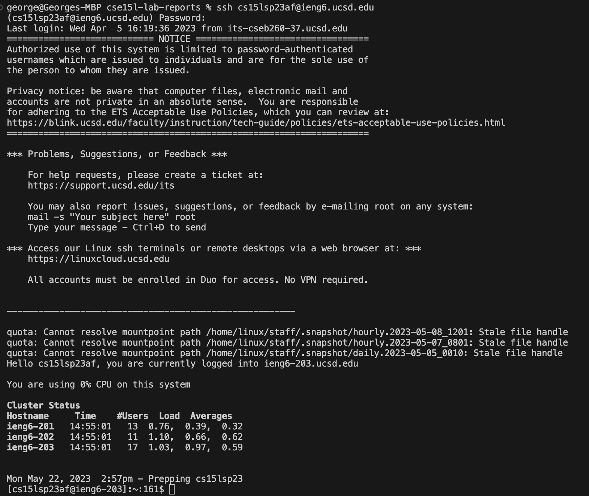
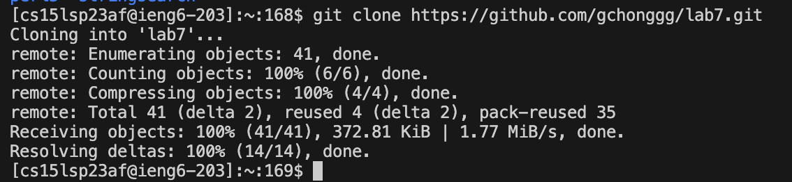
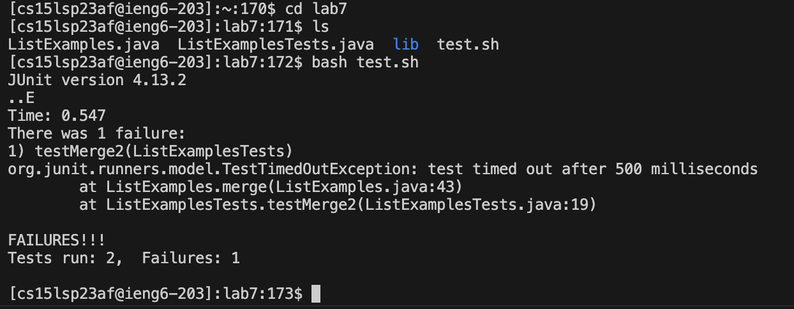
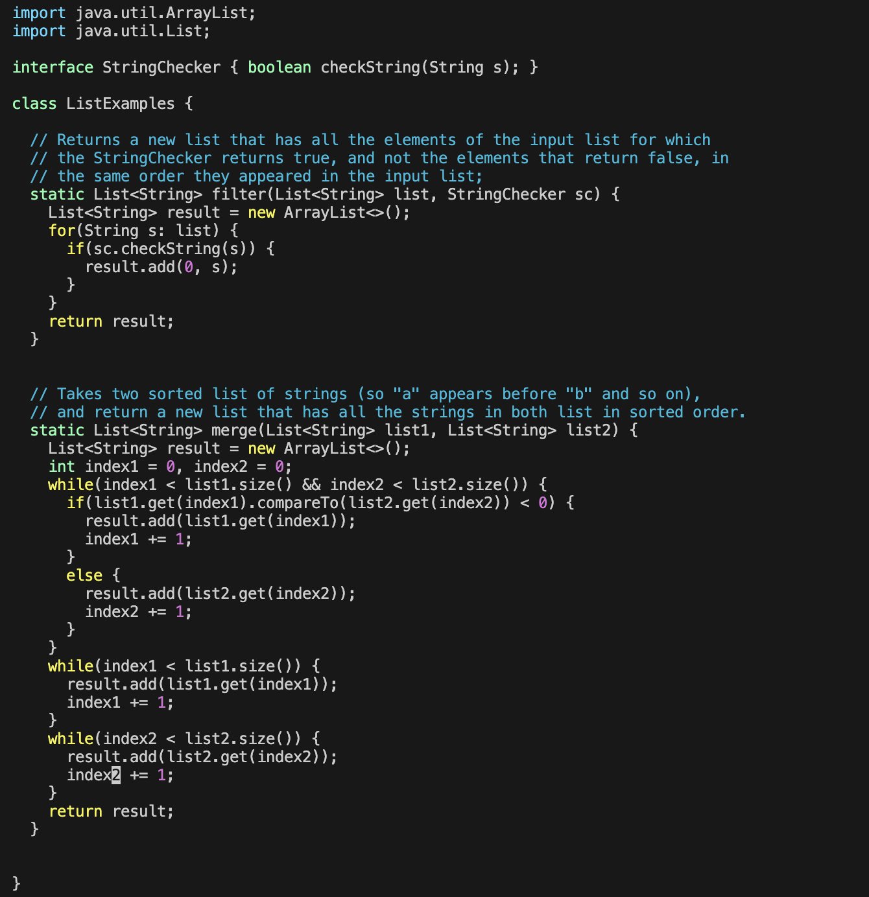
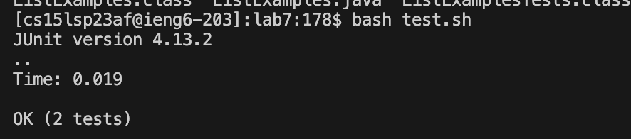
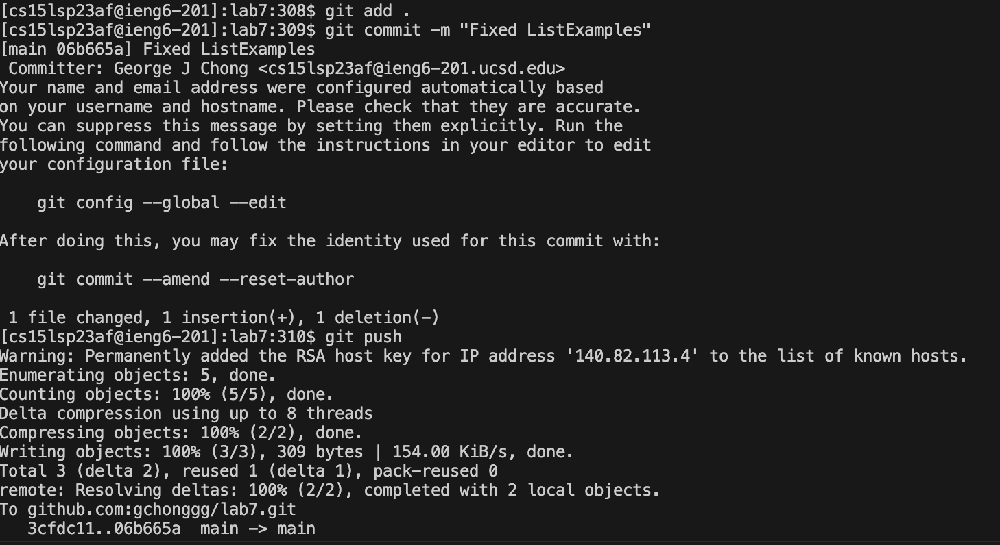

# Lab Report 4 

## Before Step 4: Open up the terminal 
Open up your favorite terminal. We will be typing commands into
our terminal.

## Step 4: Login to ieng6
I first ssh into my ieng6 account by typing the following command into my terminal: 
```bash 
ssh cs15lsp23XX@ieng6.ucsd.edu<enter>
```
 Then, when prompted for my password I typed my password and press enter: 
 ```bash 
 <password><enter>
 ```



## Step 5: Clone your fork of the repository from your Github Account
To fork the code into my Github Account, I must first goto the lab7 Github repository: [https://github.com/ucsd-cse15l-s23/lab7/](https://github.com/ucsd-cse15l-s23/lab7/). Press on the link, and on the top right, press on the "fork" button on the top right. Now go to your forked github, press the green "Code" button and press the copy button. The link to your github is now in your clipboard. Goto your terminal and press: 
```bash 
git clone <ctrl+v>
``` 



## Step 6: Run the tests, demonstrating that they fail 
We must first change directory into `lab 7`. To run the tests, 
we must run the command, `bash test.sh`. To do this step, run the following command: 

```bash 
cd lab7<enter> 
bash test.sh<enter>  
```


The test shows that one of the test failed. 

## Step 7: Edit the code file to fix the failing test 
To fix the bug, we must first go to `ListExample.java` and replace `index1` to `index2` in the final loop in the `merge` method. To do this, I ran the following commands: 
```bash 
vim ListExamples.java<enter> 
42j6lciwindex2<esc><esc>:wq<enter>
```
The second command replaces `index1` to `index2`. The breakdown is as follows: 
- `42j`: goes down 42 lines
- `6l`: goes to the right 6 charactor 
- `ciw`: delete the word, `index1` and go into insert mode 
- `index2`: typing `index2`
- `<esc>`: go to normal mode
- `:wq`: save and quit vim 


 
## Step 8: Run the tests, demonstrating that they now succeed 
To test our code again we will rerun the `test.sh` script as follows: 
```bash 
bash test.sh<enter> 
``` 

We should now see that our code passes all the test. 


## Step 9: Commit and push the resulting change to your Github Account
Now we need to add our changes, commit them, and then push them into our github repository. To do this, we must run the following commands: 

```bash 
git add ListExamples.java<enter> 
git commit -m "Fixed error in ListExamples.java"<enter>
git push<enter>  
```
if ran sucessessfully on ieng6, you should see something similar to the following: 



