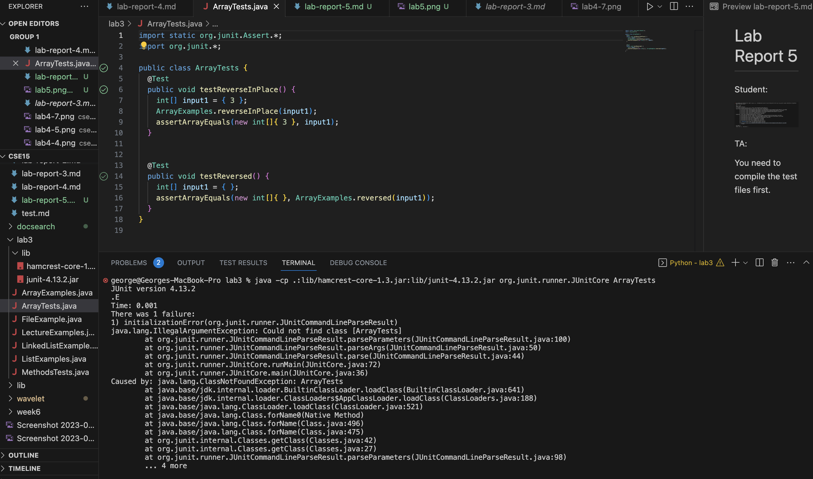
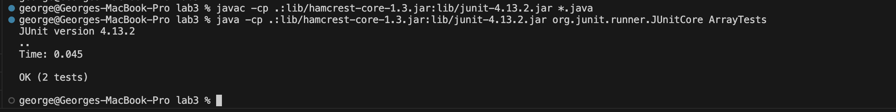
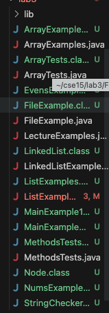
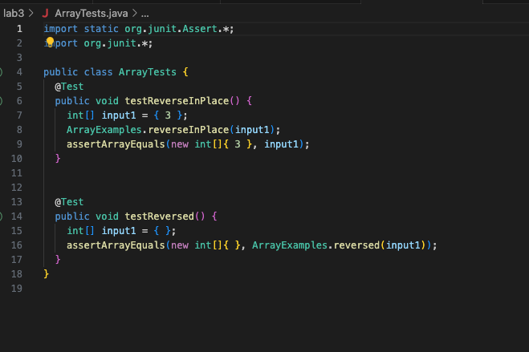
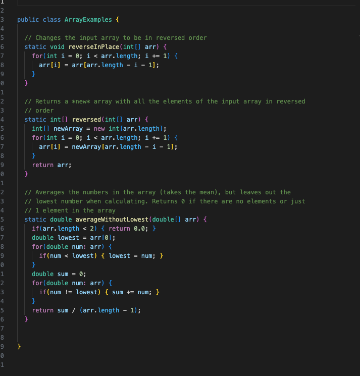

# Lab Report 5 

## Debugging Scenario
Student: 
What environment are you using (computer, operating system, web browser, terminal/editor, and so on)?

Vscode Terminal 

Detail the symptom you're seeing. Be specific; include both what you're seeing and what you expected to see instead. Screenshots are great, copy-pasted terminal output is also great. Avoid saying “it doesn't work”.

I'm trying to run the ArrayTests but encounter an illegal argument exception. I included the test file paths. 

Detail the failure-inducing input and context. That might mean any or all of the command you're running, a test case, command-line arguments, working directory, even the last few commands you ran. Do your best to provide as much context as you can.

The failing inducing input is when I run `java -cp .:lib/hamcrest-core-12.3.jar:lib/junit-4.13.2.jar org.junit.runner.JUnitCore ArrayTests`. The error is as follows: 



TA: 
Did you compile the java test files? You need to compile the test files first before running the java test file. 

Student: 
Oh wow. What a bummer. It works now. 
Thank you so much in works now. 


The file and directory structure: 




Content of each file: 

ArrayTest.java


ArrayExamples.java




The full command line (or lines) that trigger the bug.  
 `java -cp .:lib/hamcrest-core-12.3.jar:lib/junit-4.13.2.jar org.junit.runner.JUnitCore` 

 The command to fix the bug: 

 ```
javac -cp.:lib/hamcrest-core-12.3.jar:lib/junit-4.13.2.jar  *.java
 java -cp .:lib/hamcrest-core-12.3.jar:lib/junit-4.13.2.jar org.junit.runner.JUnitCore
 ```
## Reflection

Something I learning is how to debug and test files. 